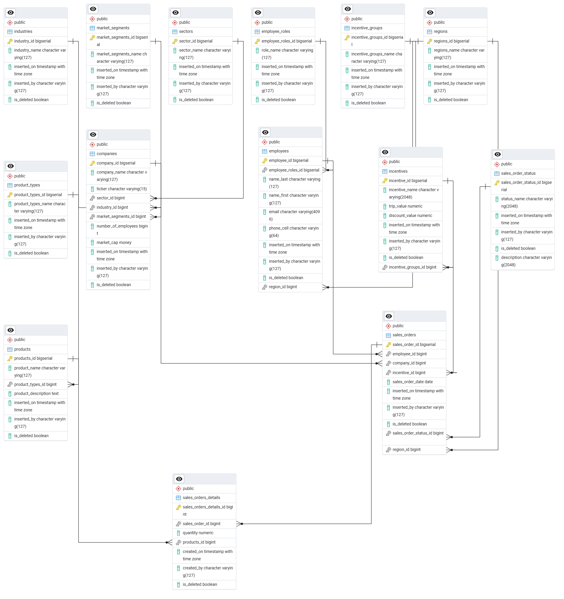

# Postgres Dev Env with a sample Sales data db

## docker base image

- https://hub.docker.com/_/postgres

## Prerequisites

- Powershell 7+
- Docker Desktop (running) or Postgres running locally
  - If using an alternative, you will have to change all connection strings, etc.
- (optional) PgAdmin4 or equivalent is recommended
- Node v24+ & NPM to generate sales data

## Starting Postgres in docker

```powershell
.\start-pg.ps1
```

## Schema and Seed Data

1. Creates a new database `salesdb`
2. Creates schema (see below)
3. Creates seed data
  * Look up tables
  * Employees
  * Products
  * Incentives
  * etc.

### Method 1: All in one Powershell 

```powershell
.\data\salesdb\sales_db_base.ps1
```

### Method 2: Manually, for example in PgAdmin4

1. Open PgAdmin4
2. Select `postgres` database
3. Open `data\salesdb\00_new_database.sql` and run it
4. Refresh databases
5. Switch to the newly created `salesdb` database
6. Open `data\salesdb\01_create_objects.sql` and run it
7. Open and `data/salesdb/02_insert_data.sql` run it (this does the seed data, no sales data)

## Sales DB Schema



## Generating some actual Sales Orders (and details)

This is a little utility in Node/Typescript

```text
generate_data.ps1 [[-Year] <string>] [[-Number] <int>]
```

- `-Year` Year to generate data for
  - Default: `2024`
- `-Number` Number of Sales Orders to generate
  - Default: `100`

```powershell
# With default parameters
.\src\generate_data.ps1
```

```powershell
# With additional parameters
.\src\generate_data.ps1 -Year 2022 -Number 50
```

For more see: [Instructions](src\README.md)

## stopping Postgres in Docker

```powershell
.\stop-pg.ps1
```
